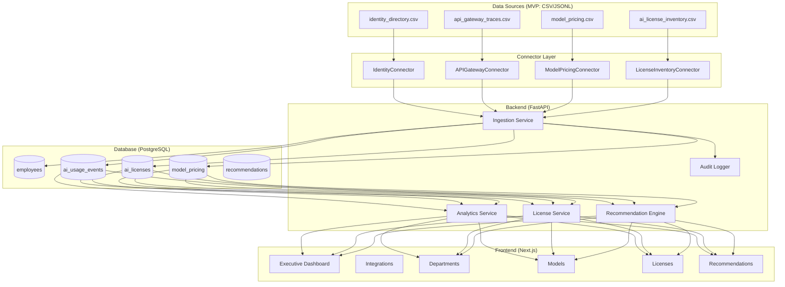

# TokenFlow AI

**Enterprise AI Cost, Usage & Governance Intelligence Platform**

A portfolio-grade full-stack SaaS project that helps companies understand, monitor, and optimise their enterprise AI spend — built with Next.js, FastAPI, PostgreSQL, and a connector-based ingestion architecture.

---

## Problem Statement

Enterprise AI usage is fragmented across browser tools, IDE assistants, internal APIs, Slack bots, and model gateways. Finance teams can't see where AI budget is going. Engineering leads don't know which models are being overused. IT can't identify shadow AI risks. HR and Legal have no visibility into PII exposure.

TokenFlow AI brings all of that into a single governance dashboard.

---

## What it answers

| Question | Feature |
|---|---|
| Where is our AI spend going? | Dashboard overview + department breakdown |
| Which models are being overused? | Model optimization page |
| Are employees using expensive models for simple tasks? | Expensive-model misuse flags + recommendations |
| Are paid licenses being underused? | License waste detection |
| Are there shadow AI risks? | Governance alerts (Phase 2) |
| Are there abnormal cost spikes? | Cost anomaly recommendations |
| What can we do to reduce waste? | Recommendation center with human review |

---

## Privacy & Ethics

This platform is **not employee surveillance software**.

- **Team-first analytics** — individual-level data is admin-restricted
- **No raw prompts stored** — metadata only, PII-redacted by default
- **No automated disciplinary decisions** — all recommendations require human review
- **Audit logging** — every action is logged
- **No employee ranking** — no performance scoring

---

## Architecture



### Connector upgrade path

Each MVP connector reads CSV today. To connect to a real system, only `_fetch_raw()` changes:

| Connector | MVP source | Production equivalent |
|---|---|---|
| IdentityConnector | `identity_directory.csv` | Okta / Azure AD / Google Workspace SCIM API |
| APIGatewayConnector | `api_gateway_traces.csv` | Envoy/Kong gateway → ClickHouse |
| ModelPricingConnector | `model_pricing.csv` | Provider pricing APIs + internal DB |
| LicenseInventoryConnector | `ai_license_inventory.csv` | ChatGPT Enterprise / GitHub Copilot admin APIs |
| *(Phase 2)* BrowserExtConnector | `browser_extension_events.csv` | Chrome extension telemetry stream |
| *(Phase 2)* KafkaConnector | `kafka_ai_telemetry.jsonl` | Kafka topic `ai.telemetry.events` |
| *(Phase 2)* ClickHouseConnector | `clickhouse_ai_traces.csv` | ClickHouse `ai_request_traces` |
| *(Phase 2)* K8sConnector | `kubernetes_gateway_logs.csv` | Kubernetes / Prometheus metrics |

---

## Synthetic Data

Generated by `scripts/generate_synthetic_data.py` (seeded, reproducible):

| File | Rows | Simulates |
|---|---|---|
| `identity_directory.csv` | 150 | SSO/SCIM employee export |
| `model_pricing.csv` | 12 | Provider pricing tables |
| `ai_license_inventory.csv` | 220 | AI seat assignments + activity |
| `api_gateway_traces.csv` | 120,000 | AI API request traces (6 months) |

Includes realistic anomalies: inactive paid seats, duplicate licenses, expensive models on simple tasks, 3 cost-spike weeks, and failed requests.

---

## Tech Stack

| Layer | Technology |
|---|---|
| Frontend | Next.js 15, TypeScript, Tailwind CSS, shadcn/ui, Recharts |
| Backend | FastAPI, Python 3.12, SQLAlchemy 2, Pydantic v2 |
| Database | PostgreSQL 16 |
| Containerisation | Docker, docker-compose |
| Data generation | Python (pandas, numpy) |

---

## Local Setup (no Docker)

**Prerequisites:** Python 3.11+, Node 18+, PostgreSQL running locally.

```bash
# 1. Clone / enter project
cd tokenflow_ai

# 2. Create Postgres role + database
psql -U postgres -c "CREATE USER tokenflow WITH PASSWORD 'tokenflow';"
psql -U postgres -c "CREATE DATABASE tokenflow_db OWNER tokenflow;"

# 3. Generate synthetic data
python3 scripts/generate_synthetic_data.py

# 4. Start everything
bash scripts/dev_start.sh
```

Open **http://localhost:3001** — the script syncs all connectors and generates recommendations automatically.

## Docker Setup

```bash
cp .env.example .env
docker-compose up --build
```

On first boot, sync the data:

```bash
curl -X POST http://localhost:8000/api/integrations/sync/all/run
curl -X POST http://localhost:8000/api/recommendations/generate
```

---

## API Reference

| Method | Endpoint | Description |
|---|---|---|
| GET | `/health` | Health check |
| POST | `/api/integrations/sync/{source}` | Sync one connector |
| POST | `/api/integrations/sync/all/run` | Sync all connectors |
| GET | `/api/integrations/status` | Connector status |
| GET | `/api/dashboard/overview` | KPI summary |
| GET | `/api/dashboard/spend-over-time` | Daily spend series |
| GET | `/api/dashboard/departments` | Per-department stats |
| GET | `/api/dashboard/models` | Per-model stats |
| GET | `/api/licenses/waste` | Inactive + duplicate seats |
| POST | `/api/recommendations/generate` | Run recommendation engine |
| GET | `/api/recommendations` | List recommendations |
| PATCH | `/api/recommendations/{id}/review` | Accept / reject |
| GET | `/api/audit` | Audit log |

Interactive docs: **http://localhost:8001/docs**

---

## Database Schema (key tables)

```sql
employees           -- SSO identity roster
model_pricing       -- per-model token costs
ai_licenses         -- seat assignments + usage signal
ai_usage_events     -- normalised event table (all connectors → here)
recommendations     -- rule-based savings opportunities
integration_sync_runs -- connector run history
audit_logs          -- all system actions
```

---

## Project Structure

```
tokenflow_ai/
├── scripts/
│   ├── generate_synthetic_data.py   # synthetic data generator
│   └── dev_start.sh                 # one-command local dev
├── synthetic-data/                  # generated CSV/JSONL files
├── backend/
│   ├── app/
│   │   ├── main.py                  # FastAPI entrypoint
│   │   ├── config.py
│   │   ├── database.py
│   │   ├── models/                  # SQLAlchemy ORM models
│   │   ├── schemas/                 # Pydantic I/O schemas
│   │   ├── connectors/              # CSV readers → real APIs later
│   │   ├── services/                # analytics, ingestion, recs
│   │   └── api/                     # route handlers
│   ├── requirements.txt
│   └── Dockerfile
├── frontend/
│   ├── app/                         # Next.js App Router pages
│   ├── components/                  # Shared UI components
│   ├── lib/                         # api.ts, utils.ts
│   └── Dockerfile
├── docker-compose.yml
└── .env.example
```

---

## Resume Bullets

- Built a full-stack enterprise AI governance platform (Next.js + FastAPI + PostgreSQL) that ingests 120k+ synthetic AI request traces and surfaces cost optimisation recommendations
- Designed a connector-based ingestion architecture where each CSV reader is a drop-in replacement for a real integration (Okta SCIM, ClickHouse, Kafka, GitHub Copilot admin API)
- Implemented a rule-based recommendation engine that flags expensive-model misuse, inactive paid seats, and cost spikes — projecting $760+/month in savings on synthetic data
- Applied privacy-by-design principles: team-level analytics by default, no raw prompt storage, all recommendations gated behind human review
- Containerised with Docker Compose; backend serves 8 REST endpoints under 200ms on local Postgres

---

## Limitations (MVP)

- Uses synthetic data — no real enterprise telemetry
- No authentication / RBAC (conceptual only)
- No incremental connector sync (full reload on each run)
- Phase-2 connectors (browser extension, Kafka, ClickHouse, K8s) are stubbed with placeholder pages
- Recommendation engine is rule-based, not ML-based

---

## Phase 2 Roadmap

- [ ] Browser extension telemetry connector
- [ ] Kafka consumer connector
- [ ] ClickHouse analytics connector
- [ ] Kubernetes gateway logs connector
- [ ] Productivity metrics connector (GitHub / Jira)
- [ ] Incremental sync with watermark tracking
- [ ] JWT authentication + RBAC
- [ ] Alembic migrations
- [ ] GitHub Actions CI (lint + test + build)
